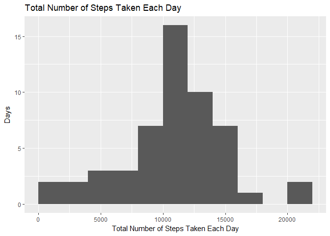
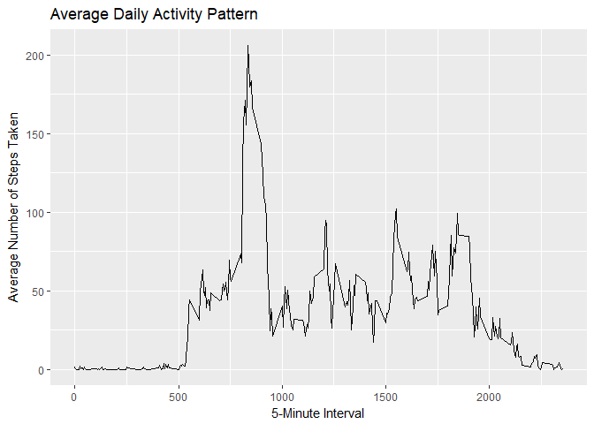
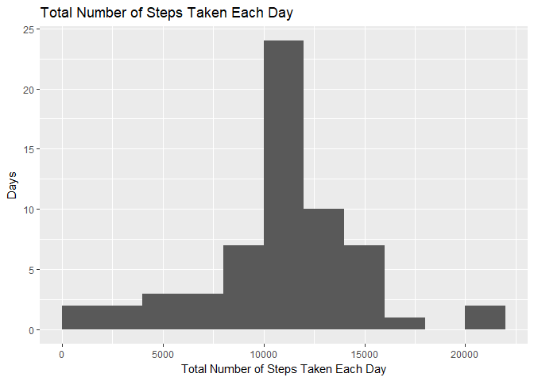
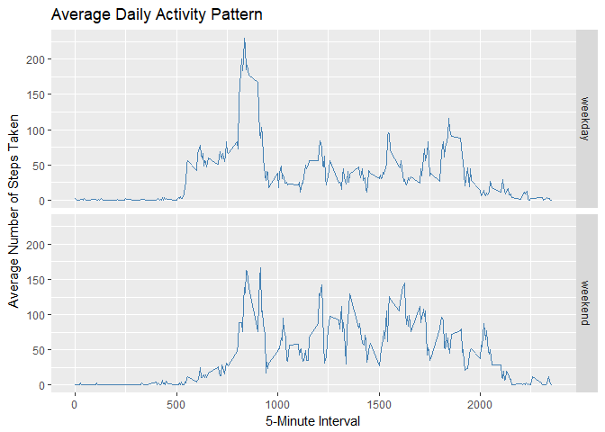

# Reproducible Research: Peer Assessment 1
Chih-Hsuan Wei  


## Loading and preprocessing the data
**Please refer to Q1.R for this part.**


```r
library(dplyr)
```

```
## 
## Attaching package: 'dplyr'
```

```
## The following objects are masked from 'package:stats':
## 
##     filter, lag
```

```
## The following objects are masked from 'package:base':
## 
##     intersect, setdiff, setequal, union
```

```r
library(ggplot2)
```

Forking and clone [the repository from GitHub](https://github.com/rdpeng/RepData_PeerAssessment1).

Unzip the "activity" directory and load the data.


```r
unzip("./activity.zip", 
      exdir = "./activity")
act <- read.csv("./activity/activity.csv")
head(act)
```

```
##   steps       date interval
## 1    NA 2012-10-01        0
## 2    NA 2012-10-01        5
## 3    NA 2012-10-01       10
## 4    NA 2012-10-01       15
## 5    NA 2012-10-01       20
## 6    NA 2012-10-01       25
```

```r
str(act)
```

```
## 'data.frame':	17568 obs. of  3 variables:
##  $ steps   : int  NA NA NA NA NA NA NA NA NA NA ...
##  $ date    : Factor w/ 61 levels "2012-10-01","2012-10-02",..: 1 1 1 1 1 1 1 1 1 1 ...
##  $ interval: int  0 5 10 15 20 25 30 35 40 45 ...
```

Transform the date variable into Date class.


```r
act$date <- as.Date(act$date, "%Y-%m-%d")
```

## What is mean total number of steps taken per day?
**Please refer to Q2.R and Q3.R for this part.**  

Calculate the total number of steps taken per day.


```r
sum <- act %>% group_by(date) %>% summarize(total = sum(steps, na.rm = F))
head(sum)
```

```
## # A tibble: 6 x 2
##         date total
##       <date> <int>
## 1 2012-10-01    NA
## 2 2012-10-02   126
## 3 2012-10-03 11352
## 4 2012-10-04 12116
## 5 2012-10-05 13294
## 6 2012-10-06 15420
```

Make a histogram of the total number of steps taken each day.


```r
g <- ggplot(sum, aes(total)) + geom_histogram(binwidth = 2000, boundary = 0, na.rm = T)  # It's important to try different binwidths
g + labs(title = "Total Number of Steps Taken Each Day") + labs(x = "Total Number of Steps Taken Each Day", y = "Days")
```

<!-- -->

Calculate the mean and median of the total number of steps taken per day.


```r
mean(sum$total, na.rm = T)
```

```
## [1] 10766.19
```

```r
median(sum$total, na.rm = T)
```

```
## [1] 10765
```

## What is the average daily activity pattern?
**Please refer to Q4.R and Q5.R for this part.** 

Calculate the total number of steps taken per day.


```r
avg <- act %>% group_by(interval) %>% summarize(avg = mean(steps, na.rm = T))
head(avg)
```

```
## # A tibble: 6 x 2
##   interval       avg
##      <int>     <dbl>
## 1        0 1.7169811
## 2        5 0.3396226
## 3       10 0.1320755
## 4       15 0.1509434
## 5       20 0.0754717
## 6       25 2.0943396
```

Make a time series plot of the 5-minute interval (x-axis) and the average number of steps taken, averaged across all days (y-axis).


```r
g <- ggplot(avg, aes(interval, avg, group = 1)) + geom_line(na.rm = T)
g + labs(title = "Average Daily Activity Pattern") + labs(x = "5-Minute Interval", y = "Average Number of Steps Taken")
```

<!-- -->

Find out the 5-minute interval containing the maximum number of steps on average across all the days in the dataset.


```r
avg[which.max(avg$avg), 1]
```

```
## # A tibble: 1 x 1
##   interval
##      <int>
## 1      835
```

## Imputing missing values
**Please refer to Q6.R and Q7.R for this part.**

Calculate the total number of missing values in the dataset.


```r
sum(is.na(act$steps))
```

```
## [1] 2304
```

Impute missing values with  the mean for that 5-minute interval.


```r
act.na <- act[is.na(act$steps), ]
act[is.na(act$steps), 1] <- avg[avg$interval %in% as.character(act.na[, 3]), 2]
head(act)
```

```
##       steps       date interval
## 1 1.7169811 2012-10-01        0
## 2 0.3396226 2012-10-01        5
## 3 0.1320755 2012-10-01       10
## 4 0.1509434 2012-10-01       15
## 5 0.0754717 2012-10-01       20
## 6 2.0943396 2012-10-01       25
```

Create a new dataset that is equal to the original dataset but with the missing data filled in.


```r
write.csv(act, file = "./imputedna.csv")
```

Make a histogram of the total number of steps taken each day.


```r
sum <- act %>% group_by(date) %>% summarize(total = sum(steps))
g <- ggplot(sum, aes(total)) + 
  geom_histogram(binwidth = 2000, boundary = 0, na.rm = T)  
g + labs(title = "Total Number of Steps Taken Each Day") + 
  labs(x = "Total Number of Steps Taken Each Day", y = "Days")
```

<!-- -->

Calculate the mean and median total number of steps taken per day.


```r
mean(sum$total)
```

```
## [1] 10766.19
```

```r
median(sum$total)
```

```
## [1] 10766.19
```

## Are there differences in activity patterns between weekdays and weekends?
**Please refer to Q8.R for this part.**

Create a new factor variable in the dataset with two levels - "weekday" and "weekend" indicating whether a given date is a weekday or weekend day.


```r
day <- vector()
for (i in 1:length(act$date)) {
  weekdays <-  weekdays(act$date[i])
  if (weekdays %in% c("Saturday", "Sunday")) {
    day <- append(day, "weekend")
  } else {
    day <- append(day, "weekday")
  }
}
day <- factor(day)
act <- mutate(act, day = day)
```

Split the data frame by the day factor and summarize them respectively. Then bind then together and adding day factor as the third column.


```r
split <- split(act, f = act$day)
avg.weekday <- split$weekday %>% group_by(interval) %>% 
  summarize(avg = mean(steps, na.rm = T))
avg.weekend <- split$weekend %>% group_by(interval) %>% 
  summarize(avg = mean(steps, na.rm = T))
df <- rbind(avg.weekday, avg.weekend)
df <- mutate(df, day = rep(c("weekday", "weekend"), each = 288))
df$day <- factor(df$day)
```

Make a panel plot containing a time series plot of the 5-minute interval (x-axis) and the average number of steps taken, averaged across all weekday days or weekend days (y-axis).


```r
g <- ggplot(df, aes(interval, avg)) + geom_line(color = "steelblue") + 
  facet_grid(day ~ .)
g + labs(title = "Average Daily Activity Pattern") + labs(x = "5-Minute Interval", y = "Average Number of Steps Taken")
```

<!-- -->
